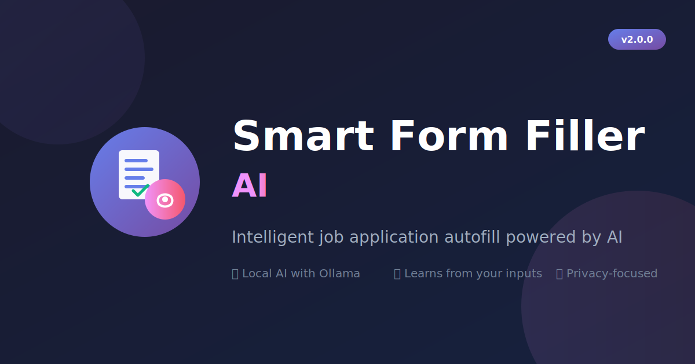

# Smart Form Filler AI 🚀

<p align="center">
  
</p>

<p align="center">
  <strong>AI-powered Chrome extension that intelligently fills job applications and web forms using your profile data.</strong>
  <br>
  Features local AI support, learning capabilities, and optional RAG memory for smarter fills.
</p>

<p align="center">
  <a href="https://chrome.google.com/webstore"></a>
  <a href="https://github.com/AkashRanjan23/smart-form-filler/releases"></a>
  <a href="./tests"></a>
  <a href="./LICENSE"></a>
</p>

<p align="center">
  <a href="#-features">Features</a> •
  <a href="#-quick-start">Quick Start</a> •
  <a href="#-usage">Usage</a> •
  <a href="#-ai-configuration">AI Config</a> •
  <a href="#-development">Development</a>
</p>

---

## ✨ Features

- **🤖 AI-Powered Filling** - Uses Ollama (local) or Gemini AI to intelligently fill form fields
- **📚 Learning Mode** - Learns from your manual inputs to improve future fills
- **🧠 AI Brain (Optional)** - RAG-powered memory server for context-aware, accurate responses
- **📝 Profile Management** - Store your personal info, experience, education, and skills
- **📄 Resume Import** - Import your resume (PDF/text) to auto-populate profile
- **✉️ Cover Letter Generator** - AI-generated cover letters tailored to job descriptions
- **🎯 Smart Matching** - Handles variations in field names (firstName, first_name, fname, etc.)
- **🔒 Privacy First** - All data stored locally, AI runs on your machine

## 🚀 Quick Start

### One-Command Setup (Recommended)

Clone the repo and run the automated setup script:

```bash
# Clone the repository
git clone https://github.com/akashranjanofficial/smart-form-filler-ai.git
cd smart-form-filler-ai

# Run automated setup (installs everything!)
python3 setup.py
```

The setup script will:
- ✅ Check and install Node.js if needed
- ✅ Install and start Ollama
- ✅ Download AI models (llama3.2:3b)
- ✅ Install all npm dependencies
- ✅ Create default configuration files
- ✅ Set up the AI Brain server

**Setup Options:**
```bash
python3 setup.py --check       # Check requirements only
python3 setup.py --ollama      # Setup Ollama only
python3 setup.py --dev         # Setup dev environment only
python3 setup.py --skip-models # Skip model downloads
```

### Manual Installation

1. **Download** the extension from [Chrome Web Store](#) or clone this repo
2. **Open** `chrome://extensions/` in Chrome
3. **Enable** "Developer mode" (top right)
4. **Click** "Load unpacked" and select the extension folder
5. **Pin** the extension icon for easy access

### Profile Setup

1. Click the extension icon → Fill in your **Profile** (name, email, phone, etc.)
2. Add your **Experience**, **Education**, and **Skills**
3. (Optional) Configure AI settings in **Settings** tab

## 🎮 Usage

### Basic AutoFill
1. Navigate to any job application form
2. Click the **🤖 AutoFill** button (or use the floating button on the page)
3. Watch your form get filled automatically!

### Learning Mode
1. Fill out a form manually with your answers
2. Click **💾 Learn** to save those Q&A pairs
3. Next time, AutoFill will use your learned answers!

### AI Brain (Advanced)
For smarter, context-aware filling:
1. Start the AI Brain server: `cd ai-brain-server && npm run dev`
2. Enable "AI Brain" in the extension settings
3. Your fills now use RAG memory for better accuracy

## ⚙️ Configuration

### AI Options

| Option | Description |
|--------|-------------|
| **Local Model (Ollama)** | Free, private, runs on your machine. Requires [Ollama](https://ollama.ai) installed |
| **Gemini API** | Fast, accurate, requires API key from [Google AI Studio](https://makersuite.google.com/app/apikey) |
| **AI Brain** | Optional local server with memory/RAG for the best results |

### Ollama Setup

If you used `setup.py`, Ollama is already configured! For manual setup:

```bash
# Install Ollama (macOS)
brew install ollama

# Start Ollama
ollama serve

# Pull a model
ollama pull llama3.2:3b
```

### AI Brain Server Setup
```bash
cd ai-brain-server
npm install
npm run dev
# Server runs on http://localhost:3000
```

## 📁 Project Structure

```
formfiller/
├── manifest.json          # Extension configuration
├── background/            # Service worker (AI calls, storage)
│   └── service-worker.js
├── content/               # Content script (form detection, filling)
│   └── content.js
├── popup/                 # Extension popup UI
│   ├── popup.html
│   ├── popup.js
│   └── popup.css
├── styles/                # Injected styles
│   └── content.css
├── icons/                 # Extension icons
├── ai-brain-server/       # Optional RAG memory server
│   ├── src/
│   │   ├── index.ts       # Express server
│   │   └── services/
│   │       ├── broca.ts   # LLM service
│   │       └── hippocampus.ts  # Vector memory
│   └── tests/
└── tests/                 # Unit & E2E tests
```

## 🧪 Testing

```bash
# Run all extension tests
npm test

# Run specific test suites
npx jest tests/service-worker.test.js
npx jest tests/content.test.js

# Run AI Brain server tests
cd ai-brain-server && npm test
```

**Test Coverage:** 112 tests across all components

## 🔐 Privacy & Security

- **Local Storage Only** - All profile data stored in Chrome's local storage
- **No Data Collection** - We don't collect or transmit your data
- **Local AI Option** - Use Ollama for 100% offline, private AI
- **Minimal Permissions** - Only requests permissions actually needed

### Permissions Explained

| Permission | Why Needed |
|------------|-----------|
| `storage` | Save your profile data locally |
| `activeTab` | Access the current tab to fill forms |
| `scripting` | Inject the form-filling script |

## 🛠️ Development

### Prerequisites
- Node.js 18+
- Chrome browser
- (Optional) Ollama for local AI

### Setup
```bash
git clone https://github.com/akashranjan/smart-form-filler.git
cd smart-form-filler
npm install
```

### Build
```bash
# Create production build
npm run build

# Package for Chrome Web Store
npm run package
```

## 📋 Changelog

See [CHANGELOG.md](./CHANGELOG.md) for version history.

## 🤝 Contributing

1. Fork the repository
2. Create your feature branch (`git checkout -b feature/amazing-feature`)
3. Commit your changes (`git commit -m 'Add amazing feature'`)
4. Push to the branch (`git push origin feature/amazing-feature`)
5. Open a Pull Request

## 📄 License

This project is licensed under the MIT License - see the [LICENSE](./LICENSE) file for details.

## 🙏 Acknowledgments

- [Ollama](https://ollama.ai) - Local LLM runtime
- [Vectra](https://github.com/Stevenic/vectra) - Vector database for RAG
- [Transformers.js](https://github.com/xenova/transformers.js) - Client-side ML

## 📞 Support

- **Issues**: [GitHub Issues](https://github.com/akashranjan/smart-form-filler/issues)
- **Email**: support@smartformfiller.com

---

Made with ❤️ by [Akash Ranjan](https://github.com/akashranjan)
